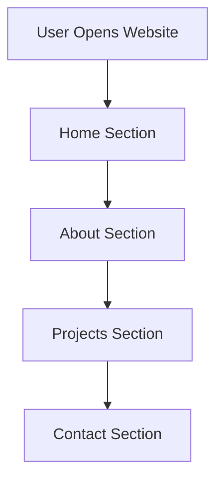
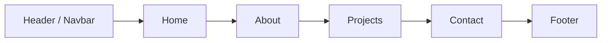

# Portfolio Website

A simple **personal portfolio website** built using **HTML, CSS, and JavaScript**.
It is designed to showcase profile, skills, projects, and contact details in a clean interface.

---

## Technologies Used

* HTML
* CSS
* JavaScript

---

## Project Structure

```
Portfolio-Website
│
├── index.html
├── style.css
├── script.js
└── assets/
```

---

## Website Flow



---

## Page Structure Diagram



---

## How to Run

1. Download or clone the repository

```
git clone https://github.com/your-username/portfolio-website.git
```

2. Open the project folder.

3. Run **index.html** in any browser.

---

## Future Improvements

* Add animations
* Add backend contact form
* Deploy online

---

⭐ This project was created for learning and portfolio purposes.
